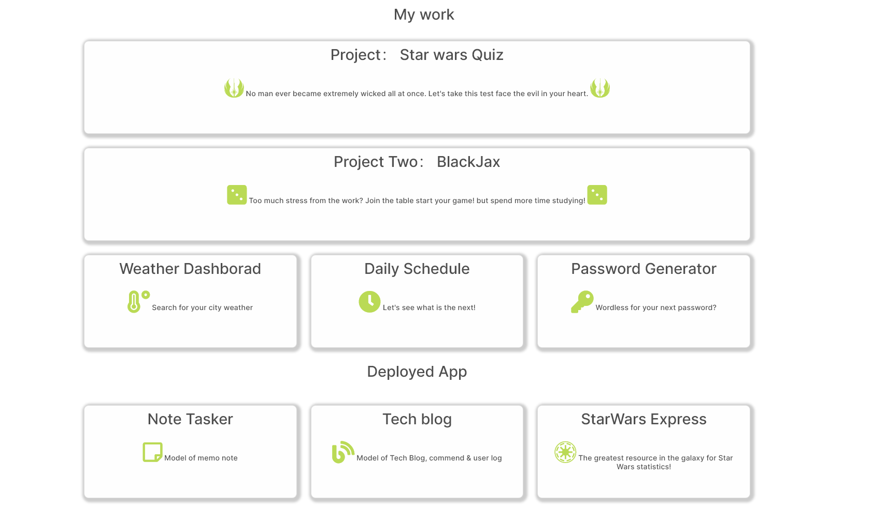
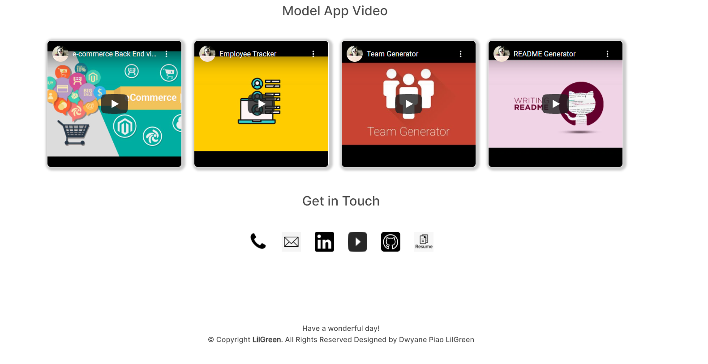

# Homework-May-22nd

==================================================================================================

## Home assignment

Background:

Update profile with current works

---

Install

This project uses VS Code, GitBash, Please check you have correctly installed those program

Please ensure your GitLab and Github account created with SSH key.

---

Usage （purpose）

Practice of Practice of JavaScript, HTML, CSS, 3rd API (Moment.js, bootstrap, Jquery, etc)

---

Contributing

for future reference

---

License

for future reference

---

### Updated Portfolio

1.  Display your contact information. If you don't want to share your personal email or phone number, use a separate email that you will only use for coding, also known as a developer email and/or a call forwarding service, such as [Google Voice](https://voice.google.com/)

    - Done, All personal email added on the profile

2.  Have links to your GitHub profile and LinkedIn profile

        - Done, Added Github profile and linkedin profile

3.  Have a link to a downloadable PDF of your resume

        - Done, Added on the PDF of newest resume

4.  Display at least 3 examples of student work from either deployed projects or homeworks. For each project, make sure you have the following:

    - Project title (Done)

    - Link to the deployed version (Done)

    - Link to the GitHub repository (Done)

    - Screenshot of the deployed application (Done)

5.  Have a polished, mobile-responsive user interface.

        - Done, Updated css for all Mobile size

## Review

You are required to submit BOTH of the following for review:

- The URL of the deployed application.
  https://sj212131.github.io/DwyaneProfile/
- The URL of the GitHub repository that contains your code. Give the repository a unique name and include a README file that describes the project.
  https://github.com/sj212131/DwyaneProfile

